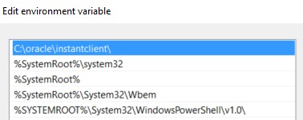
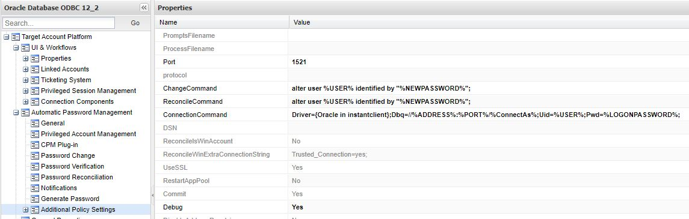
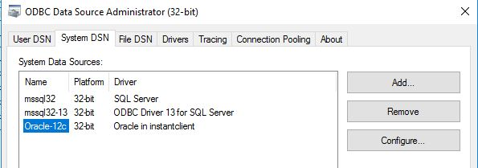
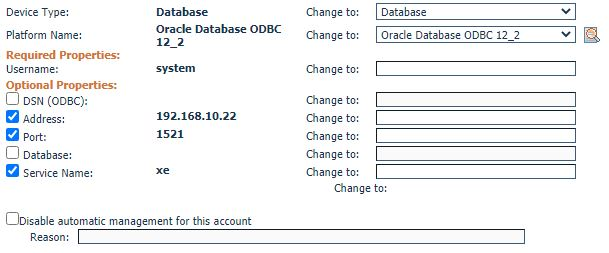
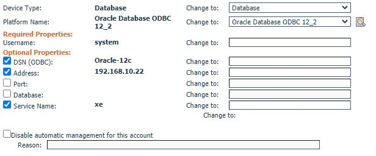
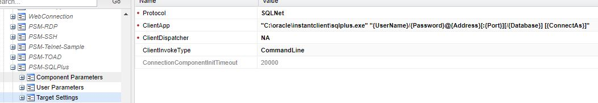

# For both DSN and DSNless

## Install Instant Client version 12 (x86 32bit)
```
https://www.oracle.com/sg/database/technologies/instant-client/microsoft-windows-32-downloads.html#license-lightbox

Download:
1. Basic Package
2. ODBC Package
3. SQL*PLUS Package (Optional, for PSM connection)

Extract package under C:\oracle (Could uninstall and replace old driver if no longer needed)
Run cmd -> odbc_install JA (Check command in the ODBC_IC_Readme_WIN)
Add path to system env.
```


## DSNless

```
Make sure the Driver parameter is correspond to the driver in ODBC setting.
```





## DSN

```
Make sure the Driver parameter is correspond to the driver in ODBC setting.
```

# SQLPLUS PSM Connection
```
Target Settings:
ClientApp: "C:\oracle\instantclient\sqlplus.exe" "{UserName}/{Password}@{Address}[:{Port}][/{Database}] [{ConnectAs}]"
```



